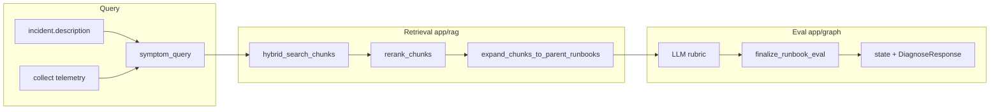

# RAG 架构、测试体系与改动同步指南

> **读者**：人类开发者 + Cursor Agent。  
> **用途**：理解当前 RAG 流水线；在修改 RAG 任一环节前，据此判断**必须同步修改**的文件、测试与数据。  
> **互补文档**：项目总览 [`architecture.md`](architecture.md)；RAG 场景 ID 见 [`test-scenario-trajectories.md`](test-scenario-trajectories.md)；语料与 golden 运维见 [`rag-eval-corpus.md`](rag-eval-corpus.md)。

---

## 1. RAG 在 Agent 中的职责

RAG 挂在 LangGraph 节点 **`eval_runbook`**，职责是 **runbook coverage judgment**（知识库能否指导本次处置），不是通用问答检索。

输出驱动后续图路由：

| 输出 | 含义 | 下游影响 |
|------|------|----------|
| `novel_scenario=true` | KB 无可靠覆盖 | summarize 后可能触发 runbook HITL 写回 |
| `novel_scenario=false` + `relevant_runbook` | 选中 runbook 全文 | `diagnose` / `decide` 引用 |
| `novel_reason` | 裁决原因码 | 观测、调试、golden 归因 |
| `selected_runbook_id` | 选中 runbook 文件名 stem | 磁盘加载、观测 |

`novel_scenario` 与 `decide_outcome=uncertain` **独立**：前者是 KB 覆盖；后者是处置能力/证据不足。

---

## 2. 端到端流水线

```text
incident.description + collect(遥测)
  → extract_symptoms()           # symptom_query
  → retrieve_runbook_candidates()
       hybrid top-20 (向量+BM25 RRF)
       → rerank top-10 (lexical)
       → expand_chunks_to_parent_runbooks()
       → top-3 RunbookCandidate
  → LLM RunbookEvalLLMOutput     # rubrics: list[RunbookPerDocRubric]（每篇 Stage A+B）
  → finalize_runbook_eval()      # 代码选篇 + 阈值终裁 + 规则生成 reasoning
  → load_runbook_by_stem()       # relevant_runbook 全文
```



### 2.1 入口与编排

| 入口 | 文件 | 说明 |
|------|------|------|
| 图节点 | `app/graph/nodes/eval_runbook.py` → `eval_runbook_node()` | LangGraph 调用 |
| 可测核心 | `app/graph/nodes/eval_runbook.py` → `run_runbook_eval()` | 支持 `collected_data` 覆盖、`golden_oracle` mock |
| 检索编排 | `app/graph/collection.py` → `retrieve_runbook_candidates()` | 封装 `app/rag/retrieval.py` |
| Query | `app/graph/collection.py` → `extract_symptoms()` | 规则拼接 query |

### 2.2 检索层（`app/rag/`）

| 文件 | 职责 |
|------|------|
| `retrieval.py` | 端到端：hybrid → rerank → parent → top-K |
| `hybrid.py` | Chroma 向量 + BM25，`reciprocal_rank_fusion` |
| `bm25_index.py` | 从 Chroma 建 BM25 索引（按 service 缓存） |
| `rerank.py` | 融合分 + BM25 + 词重叠重排 |
| `tokenize.py` | 中英文分词 |
| `parent.py` | chunk id → parent stem → 磁盘全文 |
| `store.py` | Chroma collection、embedding、`search_documents` |
| `ingest.py` | markdown 切分、`ensure_indexed()` / `reindex()` |

### 2.3 裁决层（`app/graph/`）

| 文件 | 职责 |
|------|------|
| `eval_schemas.py` | `RunbookCandidate`、`RunbookEvalLLMOutput`（仅 `rubrics`）、`RunbookPerDocRubric`、`RunbookEvalResult` |
| `runbook_eval_policy.py` | `finalize_runbook_eval()`、阈值、`novel_reason`、`build_eval_reasoning()`、服务 scope 强制 |
| `rag_observability.py` | `rag_snapshot_from_state()`、紧凑候选（无全文） |

### 2.4 Graph State / API 字段

定义于 `app/graph/state.py`，经 `app/graph/runner.py` 暴露到 `app/schemas.py` → `DiagnoseResponse`：

- `symptom_query`
- `novel_scenario`, `novel_reason`
- `selected_runbook_id`, `coverage_confidence`
- `runbook_candidates`, `runbook_eval_reasoning`
- `relevant_runbook`

### 2.5 配置（`app/config.py`）

| 配置项 | 默认 | 阶段 |
|--------|------|------|
| `retrieval_hybrid_top_k` | 20 | hybrid |
| `retrieval_rerank_chunk_top_k` | 10 | rerank |
| `retrieval_final_top_k` | 3 | parent → eval |
| `retrieval_rrf_k` | 60 | RRF |
| `retrieval_rerank_min_score` | 0.15 | 分数过滤（`local-hash` 时为 0） |
| `embeddings_provider` | `local-hash` | 向量集合名 / CI |
| `runbook_relevance_threshold` | 0.55 | finalize 阶段 A |
| `runbook_coverage_threshold` | 0.70 | finalize 阶段 B |
| `runbook_disambiguation_gap` | 0.12 | 消歧 |
| `runbook_disambiguation_top1_cap` | 0.75 | 消歧 |

环境变量别名见 `Settings` 字段；改阈值后需同步 **policy 单测** 与 **golden 门槛**（若行为变化）。

### 2.6 `novel_reason` 枚举

定义于 `app/graph/runbook_eval_policy.py`：

| 值 | 触发条件 |
|----|----------|
| `no_retrieval` | 候选为空 |
| `service_mismatch` | 候选 relevance 全 0（服务不符） |
| `low_relevance` | 阶段 A 未达阈值 |
| `low_coverage` | 阶段 B 未达阈值 |
| `ambiguous_candidates` | top1−top2 过小 |
| `invalid_selection` | 选中 runbook 文件缺失 |

---

## 3. 数据与语料

### 3.1 Runbook 索引语料

| 项目 | 说明 |
|------|------|
| 路径 | `data/runbooks/*.md`（当前 **55 篇**） |
| 构成 | 17 篇原生产（接 simulator）+ 38 篇 RAG 扩充 |
| 规格源 | `scripts/rag_corpus_specs.py` |
| 生成 | `scripts/generate_rag_corpus.py` |
| 命名 | `<service>-<scenario>.md`；`ingest.parse_service()` 解析服务名 |
| 模板 | 适用范围 → 症状 → 诊断 → 根因 → 处置 → 验证 → 勿用手段 |
| 入库 | `app/rag/ingest.py` → `ensure_indexed()`；变更后 **`reindex()`** |

**改 runbook 内容或增删文件后**：删除 `data/.rag_indexed_<provider>` 或调用 `reindex()`，并跑 `tests/rag_eval/`。

### 3.2 Golden Set（RAG 专用评测，不绑 simulator）

| 项目 | 说明 |
|------|------|
| 定义 | `tests/rag_eval/golden.py` → `GOLDEN_CASES`（**46 条**） |
| 筛选 | `select_golden_cases()`；smoke 子集 `REAL_LLM_SMOKE_IDS`（10 条） |
| 字段 | `id`, `service`, `incident_description`, `telemetry`, `expected_doc_id`, `expected_novel`, `must_not_select`, `challenge_type`, `difficulty` |

**challenge_type 分布**：

| 类型 | 条数 | 考验点 |
|------|------|--------|
| `easy_match` | 15 | 明显单篇匹配 |
| `same_service_disambiguation` | 20 | 同服务多篇消歧 |
| `cross_service_trap` | 2 | 跨服务误选 |
| `lexical_trap` | 3 | 近义词误导 |
| `negative_constraint` | 2 | 勿用手段 / 错误处置 |
| `novel` | 4 | 应判 novel |

### 3.3 Mock 遥测（非 golden）

`app/adapters/mock_data.py`：按 `service + scenario` 生成 `collect()` 数据。用于 `test_rag_integration.py`、`test_hybrid_retrieval.py`，与 golden 的 inline `telemetry` **并行存在**。

---

## 4. 测试体系

### 4.1 金字塔（RAG 相关）

```text
Layer 4  全链路（RAG 非主指标）
         graph_paths/test_kb.py, scripts/run_scenarios.py, test_run_scenarios.py

Layer 3  Golden 离线评测（RAG 主战场）
         tests/rag_eval/ + app/rag/eval_harness.py + scripts/rag_eval.py

Layer 2  集成契约
         tests/test_rag_integration.py, tests/test_hybrid_retrieval.py

Layer 1  策略 / ingest 单元
         tests/test_runbook_eval_policy.py, tests/test_rag.py
```

### 4.2 各测试文件职责

| 文件 | 测什么 | 是否用 Golden | LLM |
|------|--------|---------------|-----|
| `tests/test_rag.py` | `parse_service`、chunking、`extract_symptoms` 片段 | 否 | 无 |
| `tests/test_runbook_eval_policy.py` | `finalize_runbook_eval`、rubric 计分、`novel_reason` | 否 | 无 |
| `tests/test_hybrid_retrieval.py` | tokenize、RRF、rerank、hybrid、端到端 parent 检索 | 否 | 无 |
| `tests/test_rag_integration.py` | P0 query/parent；RAG-01/02；`eval_runbook_node` | 否（mock scenario） | mock |
| `tests/rag_eval/test_retrieval_golden.py` | Recall@3、must_not top1 | **是** | 无 |
| `tests/rag_eval/test_coverage_golden.py` | retrieve + oracle rubric + finalize | **是** | oracle |
| `tests/rag_eval/test_real_llm_smoke.py` | 10 条 smoke 真实 rubric | **是** | real（skip） |
| `tests/rag_eval/test_golden_select.py` | `select_golden_cases` | — | — |
| `tests/test_run_scenarios.py` | `steps[].rag` 观测字段 | 否 | mock |
| `tests/graph_paths/test_kb.py` | KB 路径 + `novel_scenario` | 否 | mock |

### 4.3 Golden 三层评测

| 层级 | 命令 | 指标 |
|------|------|------|
| L1 检索 | `pytest tests/rag_eval/test_retrieval_golden.py` | `recall_at_3`, `mrr_at_1`, `must_not_violation_rate` |
| L2 Coverage | `pytest tests/rag_eval/test_coverage_golden.py` | `end_to_end_accuracy`, `selection_accuracy`, `novel_accuracy` |
| L3 Real LLM | `RAG_EVAL_REAL_LLM=1 pytest tests/rag_eval/test_real_llm_smoke.py` | 同上（真实 rubric） |

```bash
# JSON 报告
.venv/bin/python scripts/rag_eval.py --reindex --stage all
EMBEDDINGS_PROVIDER=qwen LLM_MODE=real \
  .venv/bin/python scripts/rag_eval.py --stage real-llm --smoke --reindex
```

**CI 默认**：`EMBEDDINGS_PROVIDER=local-hash`，`LLM_MODE=mock`（coverage 用 golden oracle）。

### 4.4 场景文档中的 RAG 用例

| ID | 文档位置 | 自动化 |
|----|----------|--------|
| RAG-01 漏匹配 | `test-scenario-trajectories.md` | `test_rag_integration.py::test_rag_01_*` |
| RAG-02 误匹配/全文 | 同上 | `test_hybrid_retrieval.py` + `test_rag_02_*` |

---

## 5. Agent 改动同步指南（必读）

修改 RAG 前，在下方找到**改动类型**，按「必须同步」清单逐项检查。

### 5.0 通用要求（每次修改必做）

| 必须同步 | 原因 |
|----------|------|
| **本文 §9「版本注记」** | 追加一条**修改摘要**（日期、改动范围、关键行为变化、涉及文件/测试） |
| 若影响场景观测或 `novel_reason` | `docs/test-scenario-trajectories.md` §变更记录 |
| 若影响 golden / 语料运维 | `docs/rag-eval-corpus.md` §变更记录 |

修改摘要示例格式：`- YYYY-MM-DD：<主题> — <1～3 句说明>；关键文件：…`

### 5.1 改动 `extract_symptoms` / query 构造

**涉及文件**：`app/graph/collection.py`

| 必须同步 | 原因 |
|----------|------|
| `tests/test_rag.py` | 单元断言 |
| `tests/test_rag_integration.py` | `test_extract_symptoms_*` |
| `tests/rag_eval/golden.py` | 若新信号影响排序，调整 `telemetry` / `incident_description` |
| `tests/rag_eval/test_retrieval_golden.py` | 门槛或失败 case |
| `docs/test-scenario-trajectories.md` | 若影响 RAG-01/02 调试说明 |

**不必改**：`runbook_eval_policy.py`（除非 query 进入 LLM prompt 格式变化，见 5.5）。

---

### 5.2 改动检索：hybrid / BM25 / RRF / rerank / top-K

**涉及文件**：`app/rag/hybrid.py`, `bm25_index.py`, `rerank.py`, `retrieval.py`, `app/config.py`

| 必须同步 | 原因 |
|----------|------|
| `tests/test_hybrid_retrieval.py` | 管道行为 |
| `tests/rag_eval/test_retrieval_golden.py` | Recall 门槛 |
| `tests/rag_eval/test_coverage_golden.py` | 检索影响 finalize 输入 |
| `tests/test_rag_integration.py` | `retrieve_runbooks` / RAG-02 |
| `app/graph/eval_schemas.py` → `RetrievalScores` | 若新增分数维度 |
| `app/graph/rag_observability.py` | 观测字段 |
| `scripts/run_scenarios.py` | `rag` 快照中的 retrieval 分 |
| `docs/rag-eval-corpus.md` | 配置默认值说明 |

**BM25 索引失效**：`app/rag/bm25_index.py` → `invalidate_bm25_cache()`；`reindex()` 已调用。

**改 `retrieval_final_top_k`**：同步 `eval_runbook.py` 中 `_format_candidates_for_eval` 的展示上限（当前 `[:3]` 与配置一致）。

---

### 5.3 改动 parent 扩展 / chunking / ingest

**涉及文件**：`app/rag/parent.py`, `ingest.py`, `store.py`

| 必须同步 | 原因 |
|----------|------|
| `tests/test_rag.py` | chunking 规则 |
| `tests/test_rag_integration.py` | `expand_chunks_*`, `load_runbook_*` |
| **运行 `reindex()`** | 否则索引陈旧 |
| `tests/rag_eval/*` | 全文变化影响 BM25/召回 |
| `scripts/generate_rag_corpus.py` | 若改 runbook 模板字段 |
| `ingest.parse_service()` | 新服务前缀（两 token 服务名） |

---

### 5.4 改动 runbook 语料（增删改 `data/runbooks/`）

| 必须同步 | 原因 |
|----------|------|
| `reindex()` | 重建向量 + BM25 |
| `tests/rag_eval/golden.py` | 新 doc 需有对应 case 或更新 `expected_doc_id` / `must_not_select` |
| `scripts/rag_corpus_specs.py` | 扩充篇目源数据 |
| `app/graph/runbook_eval_policy.py` → `runbook_declared_service` | 若改「仅适用于服务」格式 |
| `tests/graph_paths/test_kb.py` | 若影响 KB 场景绑定的 runbook |
| mock：`eval_runbook._mock_select_doc_id` | `KNOWN_SERVICES` 场景名与 doc_id 对齐 |

---

### 5.5 改动 LLM rubric / prompt / `RunbookEvalLLMOutput`

**涉及文件**：`app/graph/nodes/eval_runbook.py`（`RUNBOOK_EVAL_SYSTEM_PROMPT`）, `eval_schemas.py`

| 必须同步 | 原因 |
|----------|------|
| `app/graph/runbook_eval_policy.py` → `attach_llm_rubrics` | rubric 字段合并 |
| `tests/test_runbook_eval_policy.py` | finalize 输入形态 |
| `app/graph/nodes/eval_runbook.py` → `_mock_llm_output` / `_mock_llm_output_oracle` | mock / golden oracle rubric 形态 |
| `tests/rag_eval/test_coverage_golden.py` | coverage 门槛（经 `eval_harness` 调用 oracle） |
| `tests/rag_eval/test_real_llm_smoke.py` | 真实 LLM 行为 |
| `tests/test_rag_integration.py` | `eval_runbook_node` 契约 |
| `app/graph/rag_observability.py` | 紧凑候选中的 relevance 维度 |

**规则**：LLM **不得**输出 `relevant_runbook` 全文、选篇或 reasoning；全文由 `resolve_selected_runbook()` 加载，选篇与 `runbook_eval_reasoning` 由 `finalize_runbook_eval()` / `build_eval_reasoning()` 生成。

**LLM rubric 形状**：`RunbookPerDocRubric` 在 `eval_schemas.py` 入库前接受**扁平**或**嵌套**（`relevance` / `coverage`）JSON；DashScope 自由 JSON 段由 `coerce_runbook_per_doc_rubric()` 归一化，`invoke_structured()` 在 `parsed` 缺失时从 `AIMessage` 文本兜底解析。

---

### 5.6 改动 `finalize_runbook_eval` / 阈值 / `novel_reason`

**涉及文件**：`app/graph/runbook_eval_policy.py`（含 `build_eval_reasoning`）, `app/config.py`

| 必须同步 | 原因 |
|----------|------|
| `tests/test_runbook_eval_policy.py` | **主单测**：`finalize_runbook_eval` 各 `novel_reason` 分支 + `build_eval_reasoning` 文案 |
| `tests/rag_eval/test_coverage_golden.py` | e2e / novel 门槛 |
| `tests/test_rag_integration.py` | RAG-01 novel 行为 |
| `docs/test-scenario-trajectories.md` | 阈值表、`novel_reason` 表 |
| `docs/rag-eval-corpus.md` | 指标说明 |
| `scripts/run_scenarios.py` + `tests/test_run_scenarios.py` | 观测字段 |

---

### 5.7 改动 Graph State / API 响应字段

**涉及文件**：`app/graph/state.py`, `app/graph/runner.py`, `app/schemas.py`

| 必须同步 | 原因 |
|----------|------|
| `app/graph/rag_observability.py` | `rag_snapshot_from_state` |
| `scripts/run_scenarios.py` → `STATE_KEYS`, `_response_dict` | 场景 JSON |
| `tests/test_run_scenarios.py` | 观测断言 |
| `docs/test-scenario-trajectories.md` | run_scenarios 观测表 |

---

### 5.8 改动 Golden 评测逻辑

**涉及文件**：`app/rag/eval_harness.py`, `tests/rag_eval/golden.py`, `scripts/rag_eval.py`

| 必须同步 | 原因 |
|----------|------|
| `tests/rag_eval/test_*.py` | 断言与门槛 |
| `docs/rag-eval-corpus.md` | 指标与命令 |
| 本文档 §4、§5 | 保持一致 |

**新增 golden case 检查清单**：

1. `id` 唯一；`service` 与 runbook `适用范围` 一致  
2. `telemetry` 足以支撑 `extract_symptoms` 产生判别性 query  
3. 有 `expected_doc_id` 或 `expected_novel=true`  
4. hard 消歧加 `must_not_select`  
5. 跑 `pytest tests/rag_eval/ -v`

---

### 5.9 改动 embedding 提供方

**涉及文件**：`app/rag/store.py`, `app/config.py`

| 必须同步 | 原因 |
|----------|------|
| **对新 provider 执行 `reindex()`** | 独立 Chroma collection |
| `tests/rag_eval/*` | 召回率变化 → 调整门槛或语料 |
| CI 仍可用 `local-hash`；语义评测用 `qwen` / `openai` 单独跑 |

---

## 6. 修改后验证命令（Agent 默认执行）

```bash
# 最小 RAG 回归
.venv/bin/pytest tests/test_rag.py tests/test_runbook_eval_policy.py \
  tests/test_hybrid_retrieval.py tests/test_rag_integration.py -q

# Golden 评测
.venv/bin/pytest tests/rag_eval/ -q

# 全量（含 graph_paths）
.venv/bin/pytest tests/ -q
```

语料或 ingest 变更后：

```bash
CHECKPOINTER=memory EMBEDDINGS_PROVIDER=local-hash \
  .venv/bin/python -c "from app.rag.ingest import reindex; reindex()"
```

---

## 7. 关键代码锚点（便于搜索）

| 符号 | 文件 |
|------|------|
| `eval_runbook_node` | `app/graph/nodes/eval_runbook.py` |
| `run_runbook_eval` | 同上 |
| `retrieve_runbook_candidates` | `app/graph/collection.py` |
| `retrieve_ranked_parent_chunks` | `app/rag/retrieval.py` |
| `finalize_runbook_eval` | `app/graph/runbook_eval_policy.py` |
| `GOLDEN_CASES` | `tests/rag_eval/golden.py` |
| `evaluate_retrieval_golden` | `app/rag/eval_harness.py` |
| `evaluate_coverage_golden` | 同上 |
| `evaluate_real_llm_golden` | 同上 |

---

## 8. 文档交叉引用

| 文档 | 内容 |
|------|------|
| **本文档** | 架构 + 测试 + **改动同步** |
| [`rag-eval-corpus.md`](rag-eval-corpus.md) | 语料规模、golden 命令、baseline 迭代 |
| [`test-scenario-trajectories.md`](test-scenario-trajectories.md) | 全链路场景、RAG-01/02、run_scenarios 观测 |

---

## 9. 版本注记

### 2026-06-30 · RAG eval 重构（LLM rubrics + finalize 选篇）

**动机**：将选篇与裁决说明从 LLM 剥离，由代码阈值与规则保证一致、可测。

| 项 | 变更前 | 变更后 |
|----|--------|--------|
| LLM 输出 `RunbookEvalLLMOutput` | `candidates` + 单篇 `coverage` + `selected_doc_id` + `suggested_novel` + `reasoning` | 仅 `rubrics: list[RunbookPerDocRubric]`（每篇 Stage A+B） |
| 选篇 | LLM `selected_doc_id` | `finalize_runbook_eval` 按 relevance 排序取 top1 |
| `runbook_eval_reasoning` | LLM `reasoning` 透传 | `build_eval_reasoning()` 规则生成 |
| `novel_reason` | 含 `llm_suggested_novel` | 已移除；novel 仅由阈值/消歧/scope 触发 |

**关键文件**：`eval_schemas.py`、`nodes/eval_runbook.py`、`runbook_eval_policy.py`、`rag_observability.py`（观测字段不变）

**测试**：`test_runbook_eval_policy.py`、`test_rag_integration.py`、`test_eval.py`、`test_run_scenarios.py`；golden `tests/rag_eval/*`（oracle 已改，语料 `golden.py` 无需改）

**文档**：`test-scenario-trajectories.md`、`rag-eval-corpus.md` 已同步

---

### 2026-06-30 · 嵌套 rubric JSON 归一化（DashScope 自由 JSON）

`RunbookPerDocRubric` 增加 `coerce_runbook_per_doc_rubric()`：LLM 返回 `relevance`/`coverage` 嵌套分组时展平为策略层扁平 rubric，修复 qwen3.7 等模型在 `json_object` 路径下分数被静默归零、`novel_reason=service_mismatch` 误报。`invoke_structured()` 对 DashScope 增加 `include_raw` + 文本 JSON 兜底。

**关键文件**：`eval_schemas.py`、`app/llm/provider.py`；**测试**：`tests/test_eval_schemas.py`；finalize / golden 门槛不变。

---

### 2026-06-30 · qwen3.7-plus structured output 兼容

`eval_runbook.py` 的 LLM rubric 调用改为 `invoke_structured()`（`app/llm/provider.py`），满足 DashScope 在 `json_object` 模式下要求 messages 含 `json` 字样的 API 规则；RAG 阈值与 finalize 逻辑不变。

---

- 2026-06：RAG hybrid + rerank + rubric eval + golden 46 条 + 55 runbooks + 三层评测（retrieval / coverage oracle / real LLM smoke）。
