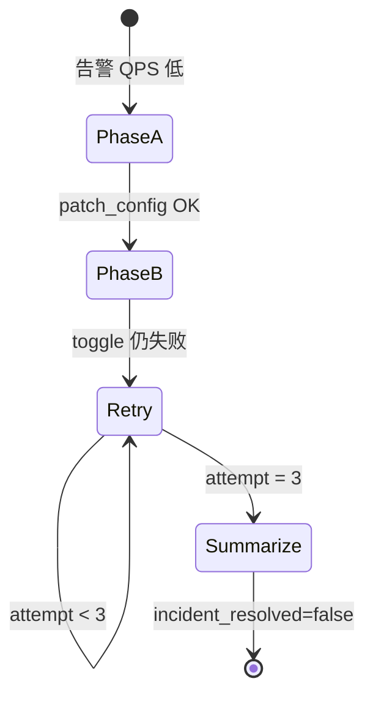

# 测试场景矩阵与预计轨迹

> **定位**：**场景目录**（测什么、预期轨迹）。  
> **不测什么**：组件实现与「怎么测该组件」— 见 [architecture.md](architecture.md) §5 与各 `*-architecture.md` §测试。

本文档为 ops-agent 调试参考：**先对照预期轨迹，再跑测试，再分层归因**。

**文档维护**：新增/修改场景预期或 RAG 观测说明后，须在本文 **§变更记录** 追加修改摘要（日期 + 范围 + 关键变化）。

## 测试分层

| 层级 | 目录 / 入口 | LLM | 目的 |
|------|----------------|-----|------|
| **图路径契约** | `tests/graph_paths/` | **mock** | 改代码后 CI 自动跑；验证「给定固定 LLM 输出时，图路由是否正确」 |
| **场景表征** | `scripts/run_scenarios.py` | **real** | 人工 / 夜间抽检；验证真实 LLM + simulator 是否符合轨迹 |
| **单元测试** | `tests/test_*.py`（非 graph_paths） | mock 或无需 | 单节点、RAG 纯函数、policy 等 |

图主路径：

```text
triage → retrieve_runbooks → diagnose
  ├─ confidence < threshold → summarize（decide_outcome=skipped_low_confidence）→ [novel? → runbook HITL]
  └─ else → decide
        ├─ uncertain（tool_select 降级）/ out_of_scope → summarize → [novel? → runbook HITL]
        └─ actionable → [approve?] → write_tools → verify_remediation
              ├─ resolved → summarize
              └─ not resolved & attempt < max → retrieve_runbooks → … (react 环)
```

默认 `max_remediation_attempts=3`。

**Simulator 分工**（后端世界剧本 vs Agent 测试场景）见 [ops-backend-simulator/README.md](../../ops-backend-simulator/README.md#design-intent)。并非每个本文件中的测试 ID 都有对应的 Simulator 模块；仅当需要 `BACKEND_MODE=real` 且验证 write → 读侧 telemetry 闭环时才绑定。

---

## 分类体系

### 一级：能力域

| 代码 | 含义 |
|------|------|
| **REM** | 主路径修复 — actionable、write、验收通过 |
| **HITL** | 人机协同闸门 — approve / runbook notes / review |
| **LOOP** | 处置反馈环 — verify_remediation、重试、morph |
| **DEC** | 决策与诚实终止 — `skipped_low_confidence`（诊断门槛）/ `uncertain`（tool 降级）/ `out_of_scope` |
| **KB** | 知识与 runbook 生命周期 — novel、写回、入库 |
| **RAG** | 检索质量 — 漏匹配、误匹配 |
| **EXEC** | 执行与验收解耦 — write FAILED vs SUCCEEDED 但未恢复 |

### 二级：路径形状（对照轨迹用）

| 形状 | 含义 |
|------|------|
| **P1** | 单次直达：decide → write → eval → summarize |
| **P2** | 带审批：… → approve → write → … |
| **P3** | 无 write 终止：decide → summarize |
| **P4** | react 环：write → eval → … → decide（多轮） |
| **P5** | 知识 HITL：summarize → notes → draft → review → [ingest] |

### 历史别名（附录）

| 旧标签 | 新 ID |
|--------|-------|
| Type A 低风险 | REM-01 |
| Type A 高风险 | REM-02 |
| Type A 审批拒绝 | HITL-01 |
| Type A 重试耗尽 | LOOP-01 |
| Type B novel 写回 | KB-01 / KB-02 |
| Type B review 拒绝 | HITL-02 |
| Type C 静态 OOS | DEC-01 |
| chaos-morph 可恢复 | LOOP-02 |
| Type C-① exhaust | LOOP-03 |
| Type C-② oos | DEC-02 |

---

## 场景总览

| ID | 能力域 | 路径 | 场景简述 | Backend | 图路径测试 | 场景表征 |
|----|--------|------|----------|---------|------------|----------|
| REM-01 | REM | P1 | 低风险自动修复（rate-limit） | mock | `graph_paths/test_rem.py` | `eval/run_eval.py` |
| REM-02 | REM | P2 | 高风险审批通过后修复（crashloop） | mock | `graph_paths/test_rem.py` | `eval/run_eval.py` |
| HITL-01 | HITL | P2 | 操作审批拒绝 | mock | `graph_paths/test_hitl.py` | — |
| HITL-02 | HITL | P5 | Runbook review 拒绝不入库 | mock | `graph_paths/test_hitl.py` | — |
| LOOP-01 | LOOP | P4 | 同根因验收失败重试耗尽 | mock + `block_remediation` | `graph_paths/test_loop.py` | — |
| LOOP-02 | LOOP | P4 | Morph 后两步可恢复（demo） | simulator | `graph_paths/test_loop.py` | `run_scenarios.py` |
| LOOP-03 | LOOP | P4 | Morph 后多轮仍不可恢复 | simulator | `graph_paths/test_loop.py` | `run_scenarios.py` |
| DEC-01 | DEC | P3 | 静态 out_of_scope | simulator | — | `run_scenarios.py` |
| DEC-02 | DEC | P3/P4 | Morph 后 early out_of_scope | simulator | `graph_paths/test_dec.py` | `run_scenarios.py` |
| KB-01 | KB | P5 | Novel + 低置信诊断 → skipped_low_confidence → 写回 | mock | `graph_paths/test_kb.py` | `run_scenarios.py` |
| KB-02 | KB | P2+P5 | Novel + 高置信 → approve → 修复后写回 | mock | `graph_paths/test_kb.py` | `run_scenarios.py` |
| RAG-01 | RAG | — | 漏匹配（有 runbook 却 novel） | — | `test_rag_integration.py` | 手工 reindex |
| RAG-02 | RAG | — | 误匹配 | — | `test_hybrid_retrieval.py`, `test_rag_integration.py` | 手工 |
| EXEC-01 | EXEC | P4 | Write 执行 FAILED | simulator | 待补 | 手工 real LLM |
| EXEC-02 | EXEC | P4 | Write 成功但验收失败 | mock / exhaust | LOOP-01、LOOP-03 | — |

---

## REM · 主路径修复

### REM-01 · 低风险自动修复（rate-limit）

**输入**：`ecomm-manager`，mock scenario `rate-limit`。

| Step | 节点链 | 关键 state / response |
|------|--------|------------------------|
| 1 | triage → … → decide | `novel_scenario=false`, `decide_outcome=actionable` |
| 2 | write_tools（自动） | `patch_config` |
| 3 | verify_remediation | `incident_resolved=true`, `remediation_attempt=1` |
| 4 | summarize | `status=completed` |

**不应出现**：`pending_node=approve`、`out_of_scope`。

---

### REM-02 · 高风险审批通过后修复（crashloop）

**输入**：`ecomm-manager` crashloop。

| Step | 节点链 | 关键 state / response |
|------|--------|------------------------|
| 1 | … → decide | `actionable`, `needs_approval=true`, `rollback_deployment` |
| 2 | approve（interrupt） | `awaiting_approval` |
| 3 | resume `approved=true` → write_tools | 执行 rollback |
| 4 | verify_remediation | `incident_resolved=true` |
| 5 | summarize | `completed` |

---

## HITL · 人机协同

### HITL-01 · 操作审批拒绝

**输入**：同 REM-02，`resume_approval(approved=False)`。

| Step | 节点链 | 关键 state / response |
|------|--------|------------------------|
| 1 | … → decide → approve | `awaiting_approval` |
| 2 | resume `approved=false` | **无** write 执行 |
| 3 | summarize | `execution_results=[]` |

---

### HITL-02 · Runbook review 拒绝

**输入**：`ecomm-search`（novel），`resume_runbook_review(approved=False)`。

| Step | 节点链 | 关键 state / response |
|------|--------|------------------------|
| 1..4 | KB-01 至 review | `awaiting_runbook_review` |
| 5 | resume `approved=false` | `runbook_rejected`，无 `runbook_saved_path` |

---

## LOOP · 处置反馈环

### LOOP-01 · 验收失败重试耗尽

**输入**：`block_remediation("ecomm-manager")` + rate-limit。

| Step | 节点链 | 关键 state / response |
|------|--------|------------------------|
| 1..N | write → eval（失败）→ … | `remediation_history[*].resolved=false` |
| 末 | summarize | `remediation_attempt=3`, `incident_resolved=false` |

**与 LOOP-03 区别**：根因不变、无 simulator morph；测 **eval 环**。

---

### LOOP-02 · Morph 可恢复（demo）

**输入**：simulator `ecomm-manager-chaos-morph`，mock scenario `chaos-morph`。

| Step | 节点链 | 关键 state / response |
|------|--------|------------------------|
| 1 | write `patch_config` | eval: morph `REVEALED` |
| 2 | approve → `toggle_feature_flag` | eval: `resolved=true` |
| 末 | summarize | `incident_resolved=true`, simulator `RECOVERED` |

**注意**：历史 demo；不可恢复主回归见 LOOP-03 / DEC-02。

---

### LOOP-03 · Morph 不可恢复耗尽

**输入**：simulator `ecomm-manager-chaos-exhaust`。

| Step | 节点链 | 关键 state / response |
|------|--------|------------------------|
| 1 | write `patch_config` | morph REVEALED |
| 2..3 | approve → toggle / 再轮 | eval: `resolved=false` |
| 末 | summarize | `remediation_attempt=3`, `incident_resolved=false` |
| — | simulator | 始终 `BROKEN`, `recoverable=false` |



---

## DEC · 决策终止

### DEC-01 · 静态 out_of_scope

**输入**：simulator `ecomm-manager-discount-bug`。

**核心判定**（`run_scenarios.check_dec_01_passed`）：`decide_outcome=out_of_scope`、无 `execution_results`、simulator 保持 `BROKEN` 且未 `recovered`。

**终止状态**（由 `novel_scenario` 分支决定，见 `builder._route_after_summarize`）：

| 条件 | Step | 节点链 | 关键 response |
|------|------|--------|----------------|
| `novel_scenario=true`（real LLM 常见：KB 无折扣逻辑 runbook） | 1 | … → decide → summarize | `out_of_scope`，无 tool_calls |
| | 2 | summarize → `request_runbook_notes` | `status=awaiting_runbook_notes`，`pending_node=request_runbook_notes` |
| `novel_scenario=false`（mock 或检索命中 runbook） | 1 | … → decide → summarize | `out_of_scope` |
| | 2 | summarize → END | `status=completed` |

**不应出现**：`actionable`、`execution_results` 非空、simulator `recovered=true`。

---

### DEC-02 · Morph 后 early out_of_scope

**输入**：simulator `ecomm-manager-chaos-oos`。

| Step | 节点链 | 关键 state / response |
|------|--------|------------------------|
| 1 | write `patch_config` | morph `REVEALED_LOGIC` |
| 2 | decide | `out_of_scope` |
| 3 | summarize | 仅 1 条 execution_result |

**注意**：mock 图路径测试常在 **一次 invoke 内完成**；与 LOOP-03 停在多轮 `approve` 不同。

---

## KB · 知识生命周期

`novel_scenario` 仅表示知识库无 runbook 覆盖，**不**等同于 `skipped_low_confidence` / `uncertain` 或必须人工审批。诊断置信足够且 catalog 工具参数可落地时，novel 场景仍可 `actionable`（但 **novel 必走 approve**）；修复完成后经 summarize 进入 runbook 写回链。

### KB-01 · Novel + 低置信诊断 → 写回 runbook

**输入**：`ecomm-search`（无 runbook，症状/generic 日志无法收敛根因）。

| Step | 节点链 | 关键 state / response |
|------|--------|------------------------|
| 1 | … → diagnose | `novel_scenario=true`, `confidence_sufficient=false`, `diagnosis_confidence` < 0.55 |
| 2 | summarize（跳过 decide） | `decide_outcome=skipped_low_confidence` |
| 3 | notes → draft → review | HITL 链 |
| 6 | ingest | `runbook_saved_path` 非空 |

**不应出现**：进入 `decide` 节点、`decide_outcome=actionable`。

---

### KB-02 · Novel + 高置信 → 审批修复后写回 runbook

**输入**：`ecomm-cache`（无 runbook，OOMKilled + 高 restarts 证据清晰）。

| Step | 节点链 | 关键 state / response |
|------|--------|------------------------|
| 1 | … → diagnose → decide | `novel_scenario=true`, `confidence_sufficient=true`, `actionable`, `needs_approval=true` |
| 2 | approve（interrupt） | `awaiting_approval` |
| 3 | resume `approved=true` → write_tools | `restart_pods` |
| 4 | verify_remediation | `incident_resolved=true` |
| 5 | summarize → notes → draft → review | HITL 写回链 |
| 8 | ingest | `runbook_saved_path` 非空 |

---

## RAG · 检索与覆盖裁决

> 架构、golden 评测与改动同步清单：[`rag-architecture-and-tests.md`](rag-architecture-and-tests.md)。

### 流水线（读路径分两节点）

**`retrieve_runbooks`（纯检索，无 LLM）**

```text
symptom_query（incident 描述 + 遥测规则提取）
  → hybrid 召回 chunk top-20（Chroma 向量 + BM25，RRF 融合）
  → lexical rerank top-10
  → parent 全文扩展 + 去重
  → top-3 RunbookCandidate → state.runbook_candidates
```

**`diagnose` coverage（覆盖裁决，runbook rubric）**

```text
runbook_candidates
  → LLM RunbookEvalLLMOutput（仅 rubrics: list[RunbookPerDocRubric]，每篇 Stage A+B 打分，无全文）
  → finalize_runbook_eval（代码按 relevance 选 top1 + 阈值终裁 + build_eval_reasoning 生成说明）
  → relevant_runbook 从磁盘按 selected_runbook_id 加载
  → novel_scenario / novel_reason / coverage_confidence
```

离线 golden harness：`run_retrieve_and_coverage()`（别名 `run_runbook_eval()`）= retrieve + coverage（`eval_runbook.py`）。

### 阈值（`app/config.py`，可由环境变量覆盖）

| 配置项 | 默认 | 含义 |
|--------|------|------|
| `runbook_relevance_threshold` | 0.55 | 阶段 A 最高分低于此 → `novel_scenario=true` |
| `runbook_coverage_threshold` | 0.70 | 阶段 B 低于此 → novel |
| `runbook_disambiguation_gap` | 0.12 | top1−top2 过小且 top1<0.75 → novel（消歧失败） |
| `diagnosis_confidence_threshold` | 0.55 | diagnose Step3 总分低于此 → 跳过 decide（见 KB-01） |
| `retrieval_hybrid_top_k` | 20 | hybrid 召回上限 |
| `retrieval_rerank_chunk_top_k` | 10 | rerank 后进入 parent 扩展的 chunk 数 |
| `retrieval_final_top_k` | 3 | 送入 coverage rubric 的 parent 候选数 |

### `novel_reason` 枚举

| 值 | 含义 |
|----|------|
| `no_retrieval` | 检索结果为空 |
| `service_mismatch` | 候选 runbook 服务范围不匹配（relevance 全 0） |
| `low_relevance` | 阶段 A 未达阈值 |
| `low_coverage` | 阶段 B 未达阈值 / 无 coverage rubric |
| `ambiguous_candidates` | top 两名 relevance 过于接近（gap < 0.12 且 top1 < 0.75） |
| `invalid_selection` | 代码选中 runbook 后磁盘文件缺失 |

### RAG-01 · 漏匹配

已知服务有 runbook，但 `novel_scenario=true`（`novel_reason` 多为 `low_relevance` / `low_coverage`）。  
自动化：`tests/test_rag_integration.py::test_rag_01_*`；手工：`reindex()`、查 `run_scenarios` 的 `rag` 块。

### RAG-02 · 误匹配

retrieve / rubric 选错 runbook（如 crashloop vs memory-leak）。  
自动化：`tests/test_hybrid_retrieval.py::test_rerank_prefers_crashloop_*`、`test_rag_integration.py::test_rag_02_*`。

---

## run_scenarios 观测字段

`scripts/run_scenarios.py` 每步输出 JSON 结构，便于 LangSmith / 日志对照：

| 字段 | 位置 | 说明 |
|------|------|------|
| `thread_id` | step / result | LangGraph checkpoint 线程 ID |
| `response.symptom_query` | step | 检索 query |
| `response.novel_reason` | step | 覆盖裁决原因码（diagnose coverage） |
| `response.runbook_eval_reasoning` | step | finalize 规则生成的裁决说明（非 LLM 输出） |
| `response.selected_runbook_id` | step | 代码选中的 runbook stem（relevance top1 过阈值后） |
| `response.coverage_confidence` | step | 阶段 B 分数 |
| `response.diagnosis_confidence` | step | diagnose Step3 总分（RCA rubric + runbook_support） |
| `response.confidence_sufficient` | step | `diagnosis_confidence >= diagnosis_confidence_threshold` |
| `response.needs_human_review` | step | 与 `confidence_sufficient` 相反（观测字段，不驱动 approve） |
| `rag` | step | `rag_snapshot_from_state` 紧凑快照（含候选 retrieval 分、`runbook_eval_reasoning`，无全文） |
| `graph_state.runbook_candidates` | step | 紧凑候选列表（最多 5 条） |
| `embeddings` / `langsmith` | result 顶栏 | 运行环境标记 |

```bash
# mock LLM 冒烟（CI 友好，不耗 API）
CHECKPOINTER=memory .venv/bin/python scripts/run_scenarios.py --scenarios KB-01 KB-02 --mock-llm

# real LLM 表征
CHECKPOINTER=memory LLM_MODE=real .venv/bin/python scripts/run_scenarios.py --scenarios all
```

单元测试：`tests/test_run_scenarios.py`。

---

## EXEC（P1，待自动化）

错误参数 / 前置不满足 → ToolMessage FAILED。

### EXEC-02 · Write 成功验收失败

见 LOOP-01、LOOP-03。

---

## 调试归因速查

| 症状 | 优先查 |
|------|--------|
| 路由错了 | `builder.py`、`decide_outcome`、`needs_approval` |
| 工具没执行 | `approve` 拒绝？无 tool_calls？ |
| 假恢复 | `verify_remediation`、real LLM summary |
| novel 不对 | `retrieve_runbooks`、`diagnose` coverage、`novel_reason`、`runbook_eval_reasoning`、`rag/ingest`、hybrid/rerank 分数 |
| 误跳过 decide | `diagnosis_confidence`、`confidence_sufficient`、`diagnose_spec` RCA rubric |
| 混沌不对 | simulator `admin/state`、`fault_phase` |

---

## 运行命令

```bash
# 图路径契约（mock LLM，CI 推荐）
cd ops-agent
CHECKPOINTER=memory LLM_MODE=mock \
  .venv/bin/python -m pytest tests/graph_paths/ -q

# 全量单元 + 图路径
make test

# 场景表征（real LLM，需 API Key）
CHECKPOINTER=memory LLM_MODE=real \
  .venv/bin/python scripts/run_scenarios.py --scenarios all

# 默认跑 KB-01 + DEC-01
CHECKPOINTER=memory .venv/bin/python scripts/run_scenarios.py

# mock LLM 全量场景表征（无 API）
CHECKPOINTER=memory .venv/bin/python scripts/run_scenarios.py --mock-llm --scenarios all

# Simulator 状态机单测
cd ops-backend-simulator && python3 -m pytest tests/test_chaos_exhaust.py tests/test_chaos_oos.py -q
```

---

## 变更记录

### 2026-07-01 · 命名清理 + 双轨 RAG 测试

- 图节点 `eval_remediation` → **`verify_remediation`**；diagnose **coverage / rca / confidence**；harness `run_retrieve_and_coverage()`。
- Makefile：`test-rag-retrieval` / `test-rag-coverage` / `test-rag`；详见 [`rag-architecture-and-tests.md`](rag-architecture-and-tests.md) §4。

### 2026-07-01 · 主图重构：retrieve_runbooks + diagnose 三步

- 图路径：`eval_runbook` → `retrieve_runbooks`（纯检索）；`eval_diagnosis` 并入 `diagnose`（coverage + rca + confidence）。
- KB-01：`confidence < 0.55` → `decide_outcome=skipped_low_confidence`，跳过 decide 直进 summarize → KB 写回。
- KB-02：novel + 高置信仍 `actionable`，但 **novel 必 approve** 后再 write。
- `run_scenarios` 导出 `diagnosis_confidence` / `confidence_sufficient` / `needs_human_review`。
- 详见 [`graph-agent-architecture.md`](graph-agent-architecture.md) §9、[`rag-architecture-and-tests.md`](rag-architecture-and-tests.md) §9。

### 2026-06-30 · RemediationEvalAssessment coerce（verify_remediation 节点）

- `eval_schemas.coerce_remediation_eval_assessment()`：缺省 `reasoning`、别名 `is_resolved`/`symptoms` 等归一化
- 修复 real LLM（DeepSeek `json_mode`）在 `verify_remediation` 节点因缺 `reasoning` 硬崩；见 [`decide-remediation-architecture.md`](decide-remediation-architecture.md) §10

### 2026-06-30 · real LLM 表征：DEC-02 / LOOP-02 走 `uncertain` 归因（历史备忘，部分已缓解）

> **2026-07-01 后**：`eval_diagnosis` 已删除；诊断置信与 decide assessment 分裂问题已收敛到 `diagnose` 单节点 + 代码路由。下列因素在 real LLM 下仍可能导致 DEC-02 / LOOP-02 不稳定，供排查参考。

coerce 修复后场景可跑通；**同配置多次 real LLM 结果不稳定**（诊断脚本 `data/diag_dec02_loop02_out.txt` 一次 PASS、早前一次 FAIL）。

| 因素 | 说明 |
|------|------|
| **RAG 选篇偏差** | 告警文案偏 QPS/限流时，coverage 常选 `ecomm-manager-rate-limit`（relevance/coverage 双 1.0），而非专篇 `ecomm-manager-chaos-oos` / `chaos-morph`；morph 后证据已变但 runbook 上下文仍限流篇 |
| **`DECIDE_RETRY_GUIDANCE`** | `remediation_context.py` 明示「或 classify **uncertain**」；与 chaos-oos 阶段 B 应有的 **`out_of_scope`** 竞争 |
| **tool_select 降级** | `decide_node`：assessment=`actionable` 但 LLM 未产出 `tool_calls` → `_downgrade_uncertain`（LOOP-02 FAIL 路径之一） |
| **mock 对照** | mock 在 `remediation_attempt≥1` 强制切 phase；real LLM 无此捷径 |

**后续改进方向**（未实现）：混沌告警模板 + 专篇 runbook 检索加权；收紧 retry guidance（morph 后优先 OOS / 换工具）。

### 2026-06-30 · run_scenarios mock scenario 与 decide 矩阵对齐

- `run_dec_01` / `run_loop_*` / `run_dec_02`：`set_mock_scenario` 须在 `_reset_caches()` **之后**（`reset_mock_scenarios` 会清掉先前设置）
- `run_dec_01` 补充 `set_mock_scenario("ecomm-manager", "discount-bug")`，mock LLM 全量 `--scenarios all` 预期 6/6

### 2026-06-30 · DEC-01 场景断言与 novel 写回链对齐

- `run_scenarios.check_dec_01_passed`：`novel_scenario=true` 时期望 `awaiting_runbook_notes`（summarize 后进入 KB 写回 HITL），不再错误要求 `status=completed`
- real LLM + discount-bug 典型路径：OOS 决策正确 + 停在 `request_runbook_notes` 即通过

### 2026-06-30 · RAG eval 重构

- LLM 仅输出 `rubrics` list（`RunbookPerDocRubric`）；选篇与 `runbook_eval_reasoning` 由 `finalize_runbook_eval` / `build_eval_reasoning` 负责
- 移除 `novel_reason=llm_suggested_novel`；`invalid_selection` 仅表示磁盘文件缺失
- 观测：补充 `response.runbook_eval_reasoning` 说明；`selected_runbook_id` 为代码 relevance top1
- 详见 [`rag-architecture-and-tests.md`](rag-architecture-and-tests.md) §9

---

- 2026-06-26：RAG hybrid+rerank+rubric eval；`run_scenarios` 增加 `rag` / `novel_reason` 观测；`tests/test_run_scenarios.py`。
- 2026-06-26：按能力域（REM/HITL/LOOP/DEC/KB/RAG/EXEC）重分类；测试拆为 `tests/graph_paths/` + `scripts/run_scenarios.py`。
