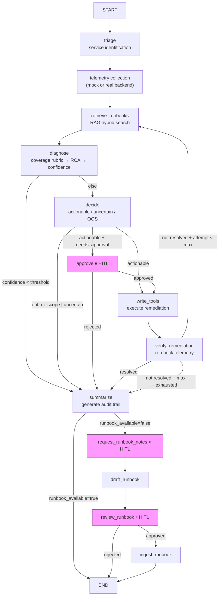

# Design: ops-agent

**Status**: Approved
**Requirements**: [requirements.md](requirements.md)

## Overview

ops-agent is a **LangGraph state-machine agent** exposed through a **FastAPI HTTP API**. It processes incident tickets through a 12-node graph: triage → telemetry collection → RAG runbook retrieval → LLM diagnosis → decision → (optional HITL) → tool execution → verification → summary, with a react loop for retry and a KB write-back chain for novel incidents.

The design follows a **separation of concerns** principle: retrieval is pure engineering (no LLM), diagnosis uses LLM for semantic judgment but code for final selection, and tool risk is evaluated by deterministic policy rather than LLM.

## Alignment with CLAUDE.md

This design respects all constraints in `CLAUDE.md`:
- **Mock-first**: all components have mock implementations; the full graph runs without API keys.
- **Python 3.12 + LangGraph + FastAPI**: no deviation from the tech stack.
- **Component boundaries**: RAG layer never invokes LLM; LLM rubric never selects runbooks; coverage judgment is in `diagnose`, not `retrieve_runbooks`.
- **Schema robustness**: all LLM JSON outputs pass through coerce functions before validation.

## Code Reuse Analysis

### Existing Components to Leverage

- **`agent/app/graph/builder.py`**: `StateGraph` with 12 nodes + 6 conditional edges. All feature work adds nodes or modifies routing here.
- **`agent/app/rag/`**: complete RAG pipeline (hybrid → rerank → parent → top-K). New retrieval features extend this.
- **`agent/app/llm/provider.py`**: `invoke_structured()` with vendor-specific routing. New LLM calls must use this single entry point.
- **`agent/app/tools/policy.py`**: `TOOL_RISK` table + `compute_needs_approval()`. New tools register here.
- **`agent/app/adapters/`**: mock/real backend adapter. New telemetry or write paths go through this facade.
- **`agent/app/config.py`**: pydantic-settings for all configuration. New thresholds or feature flags added here.

### Integration Points

- **FastAPI (`agent/app/main.py`)**: 7 endpoints. New HITL interrupts need new endpoints here.
- **LangGraph checkpointer** (`agent/app/memory/short_term.py`): sqlite/memory/redis. State changes must be checkpoint-compatible.
- **Simulator** (`ops-backend-simulator/simulator/app.py`): stateful HTTP backend for integration testing. New scenarios add modules to `simulator/scenarios/`.
- **Golden RAG eval** (`agent/tests/rag_eval/golden.py`): 46 golden cases. Runbook changes require golden updates.

## Architecture



**Key routing decisions** (6 conditional edges in `builder.py`):
- `_route_after_diagnose`: `confidence_sufficient` → decide, else → summarize
- `_route_after_decide`: `out_of_scope|uncertain` → summarize, `needs_approval` → approve, else → write_tools
- `_route_after_approve`: approved → write_tools, else → summarize
- `_route_after_verify_remediation`: resolved → summarize, attempt < max → retrieve_runbooks (react loop)
- `_route_after_summarize`: `runbook_available=false` → request_runbook_notes, else → END
- `_route_after_review`: approved → ingest_runbook, else → END

## Components and Interfaces

### RAG Pipeline (`agent/app/rag/`)

- **Purpose**: pure search — find relevant runbooks without any LLM involvement.
- **Interface**: `retrieve_top_k(query: str, service: str) → list[RunbookCandidate]`
- **Pipeline**: `extract_symptoms()` → hybrid top-20 (Chroma + BM25 RRF) → rerank top-10 (fusion + BM25 + lexical) → parent expand → top-3.
- **Dependencies**: ChromaDB (vector store), BM25 index (per-service caching).
- **Reuses**: `agent/app/rag/store.py`, `agent/app/rag/hybrid.py`, `agent/app/rag/rerank.py`, `agent/app/rag/parent.py`, `agent/app/rag/tokenize.py`.

### Diagnosis Engine (`agent/app/graph/nodes/diagnose.py` + `runbook_coverage.py`)

- **Purpose**: evaluate runbook relevance and produce root cause analysis.
- **Interface**: `diagnose(state: AgentState) → dict` (updates `rca_draft`, `confidence_assessment`, `runbook_available`).
- **Two modes**: runbook-guided (when KB has coverage) vs exploratory (novel incidents).
- **LLM rubric → code selection**: LLM outputs 4-dimension CoT per runbook; `finalize_runbook_coverage()` code selects the best match.
- **Reuses**: `agent/app/graph/runbook_coverage.py`, `agent/app/graph/diagnose_spec.py`, `agent/app/graph/categorical_rubric.py`.

### Decision & Tool System (`agent/app/graph/nodes/decide.py` + `agent/app/tools/`)

- **Purpose**: classify incident and select/execute remediation tools.
- **Interface**: `decide(state: AgentState) → dict` (updates `decide_outcome`, `needs_approval`, `selected_tools`).
- **Tool risk tiers**: HIGH (rollback, scale, drain) — always approve; MEDIUM (restart, delete_pod, cordon, circuit_breaker, flush_cache) — conditional; LOW (patch_config, toggle_feature_flag) — conditional.
- **Reuses**: `agent/app/tools/policy.py` (risk table + approval logic), `agent/app/tools/ops_tools.py` (10 tool implementations).

### Backend Adapters (`agent/app/adapters/`)

- **Purpose**: abstract telemetry source and remediation target behind a single interface.
- **Interface**: `fetch_telemetry(service: str) → TelemetrySnapshot` / `execute_tool(tool: str, params: dict) → ToolResult`.
- **Two implementations**: `MockAdapter` (offline, deterministic) / `RealAdapter` (HTTP to backend or simulator).
- **Reuses**: `agent/app/adapters/backend_client.py`, `agent/app/adapters/mock_data.py`, `agent/app/adapters/mock_remediation.py`.

### LLM Provider (`agent/app/llm/provider.py`)

- **Purpose**: single entry point for all LLM calls, with vendor-specific routing for structured output.
- **Interface**: `invoke_structured(llm, schema, messages) → BaseModel`
- **Vendor routing**: DeepSeek → json_mode; Qwen/DashScope → include_raw + fallback; OpenAI/other → standard `with_structured_output`.
- **Schema coerce**: 6 schemas have defensive coerce functions against malformed LLM JSON.

## Data Models

### AgentState (core fields, `agent/app/graph/state.py`)

```text
AgentState (TypedDict, 40+ fields)
- incident_id: str                          # unique incident identifier
- incident_description: str                 # raw incident text
- target_service: str                       # identified service (from triage)
- telemetry_snapshot: TelemetrySnapshot     # collected logs/metrics/status
- retrieved_runbooks: list[RunbookCandidate] # top-3 from RAG
- runbook_available: bool                   # KB has usable runbook?
- rca_draft: RootCauseDraft                 # diagnosis result
- confidence_sufficient: bool               # is diagnosis confident?
- confidence_assessment: DiagnosisConfidenceAssessment
- decide_outcome: DecideOutcome             # actionable | uncertain | out_of_scope
- needs_approval: bool                      # HITL gate triggered?
- selected_tools: list[ToolCall]            # tools to execute
- pending_tool_results: list[ToolResult]     # execution results
- remediation_attempt: int                  # react loop counter
- incident_resolved: bool                   # verification result
- summary: str                              # final audit summary
```

### Key Enums

- `DecideOutcome`: `actionable` | `uncertain` | `out_of_scope` | `skipped_low_confidence`
- `EvidenceSource`: log | metric | status | runbook | human_note
- `ToolRiskLevel`: HIGH | MEDIUM | LOW

## Error Handling

| Scenario | Handling | User-visible result |
|----------|----------|---------------------|
| Backend unreachable (real mode) | Exception caught; telemetry collection fails | Error status in telemetry snapshot |
| LLM returns malformed JSON | Schema coerce function applied; fallback to plain JSON parse | Validated Pydantic model or logged error |
| RAG returns zero results | `runbook_available=false`; exploratory diagnosis path | "No matching runbooks found" |
| All runbooks below match threshold | `runbook_available=false` via `match_gate_reason` | Routes to KB write-back after summary |
| Tool execution fails | Error recorded in `pending_tool_results`; verification detects | React loop retries with different tools |
| Max remediation attempts exhausted (3) | Routes to summary with failure status | "Remediation failed after 3 attempts" |
| HITL approval rejected | Routes to summary; no tools executed | "Remediation rejected by operator" |
| Runbook review rejected | KB write-back chain ends; runbook not ingested | "Runbook draft rejected" |

## Testing Strategy

### 5-Layer Test Pyramid

| Layer | What | Framework | Marker / Command |
|-------|------|-----------|------------------|
| L0: Simulator state machine | Scenario fault injection → recovery transitions | pytest | `make test-simulator` |
| L1: Unit / policy | Individual functions, tool risk, coerce | pytest | `make test` (subset) |
| L2: Graph path contracts | Full graph runs with mock LLM, fixed routes | pytest + MockChatModel | `make test-graph` |
| L3: Golden / integration | RAG retrieval + coverage against 46 golden cases | pytest | `make test-rag` |
| L4: Scenario characterization | Real LLM E2E trajectories (DEC, LOOP scenarios) | `run_scenarios.py` | manual / CI opt-in |

### Dual-Track RAG Testing

- **Track A (retrieval)**: `make test-rag-retrieval` — recall@3, MRR@1, must_not_violation_rate
- **Track B (coverage)**: `make test-rag-coverage` — end_to_end_accuracy, selection_accuracy, runbook_unavailable_accuracy

### Scenario Matrix (16 test IDs)

Detailed trajectories in `docs/agent/test-scenario-trajectories.md`.

---

*For detailed component architecture, see `docs/agent/*.md`. This document is the high-level map.*
